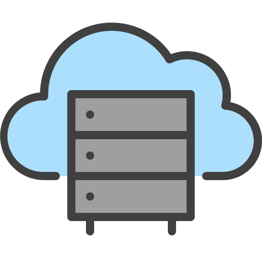

<p align="center">
  

  <p align="center">
    Personal file server, powered by Actix Web
    <br>
    <br>
    <a href="https://github.com/BeaverHouse/file-server-rust/issues/new?assignees=HU-Lee&labels=Bug&projects=&template=bug.yml&title=%5BBug%5D%3A+">Bug Report</a>
    |
    <a href="https://github.com/BeaverHouse/file-server-rust/discussions/new?category=request">Request</a>
  </p>

  <p align="center">
    <a href="https://www.rust-lang.org/">
      
    </a>
    <a href="https://actix.rs/">
      
    </a>
    <a href="https://www.postgresql.org/">
      
    </a>
    <a href="https://supabase.com/">
      
    </a>
    <a href="./LICENSE">
      
    </a>
  </p>
</p>

<br>

## Overview

A backend server for handling file uploads and downloads, powered by [Actix Web](https://actix.rs/), [Rust](https://www.rust-lang.org/).  
It uses the PostgreSQL database for managing file metadata.  
The file will be stored in [Oracle Object Storage](https://www.oracle.com/cloud/storage/object-storage/).

<br>

## Prerequisites

1. [Rust](https://www.rust-lang.org/tools/install) must be installed.
2. PostgreSQL database is required, you can use [Supabase](https://supabase.com/) or other services.
3. You need to set environment variables to run the application.

   ```env
   PG__URL=
   ORACLE_FAMILY_RW_ENDPOINT=<presigned-url-of-oracle-object-storage>
   ORACLE_AECHECK_W_ENDPOINT=<presigned-url-of-oracle-object-storage>
   ORACLE_AECHECK_R_ENDPOINT=<presigned-url-of-oracle-object-storage>
   API_KEY=
   ```

<br>

## Run the application locally

You can run the server with the following command:

```bash
cargo run
```

Otherwise, you can set up [auto-reloading](https://actix.rs/docs/autoreload) and run:

```bash
cargo watch -x run
```

<br>

## Swagger UI

The API documentation is powered by [utoipa](https://github.com/juhaku/utoipa).  
After running the server, Swagger UI is available at:

```
https://localhost:8080/file/docs/
```

<br>

## Contributing

See the [CONTRIBUTING.md](./CONTRIBUTING.md).
